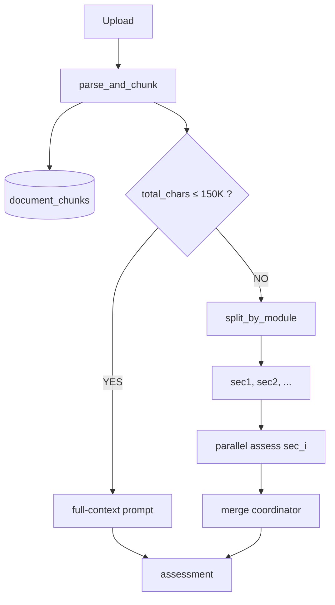

# Vấn đề: Upload SV vượt context window LLM (>200K chars)

## 1. Vấn đề (Issue)

- `code_scanner.build_prompt()` giới hạn `MAX_TOTAL_CHARS = 200000`.
  Codebase sinh viên vượt mức → **truncate im lặng** → LLM chỉ thấy
  1 phần → assessment sai, không báo lỗi.
- Đồ án SV lớn (full-stack, monorepo, nhiều file) dễ vượt 200K.
- Hướng RAG (retrieve chunk) giải quyết scale NHƯNG mất holistic view
  → giảm accuracy khi đánh giá tổng thể.

## 2. Plan / Solution

| # | Hạng mục | Vấn đề hiện tại | Giải pháp | Ưu tiên | Ghi chú |
|---|----------|----------------|-----------|----------|--------|
| 1 | Context cap | Truncate im lặng >200K | Threshold 150K → switch mode | Cao | Phát hiện sớm |
| 2 | Đồ án nhỏ (<150K) | — | Full-context (giữ nguyên) | — | 95% case, accuracy cao nhất |
| 3 | Đồ án lớn (>150K) | Truncate → sai | Split by module → parallel assess → merge coordinator | Cao | Multi-pass, không cần embedding |
| 4 | Chunk storage | `document_chunks` unused | Populate lúc upload | TB | Citation (sources[]) + fallback |
| 5 | RAG / embedding | None | Defer | Thấp | Chỉ khi >300K cực lớn |
| 6 | Read module | `extract_code_files` OK | Reuse nguyên | — | DRY, ingest + assess cùng dùng |
| 7 | Question-gen | Inline dup + dead | Consolidate sau | TB | Refactor riêng |

## 3. Flow

## 4. Quyết định kiến trúc

- **Full-context** = default (accuracy cao nhất cho đồ án nhỏ).
- **Multi-pass** = fallback cho đồ án lớn (xử lý được mà không cần
  embedding service).
- **RAG / embedding** = defer đến khi repo cực lớn (>300K).
- `document_chunks` luôn populate → sẵn sàng cho citation + RAG sau.
